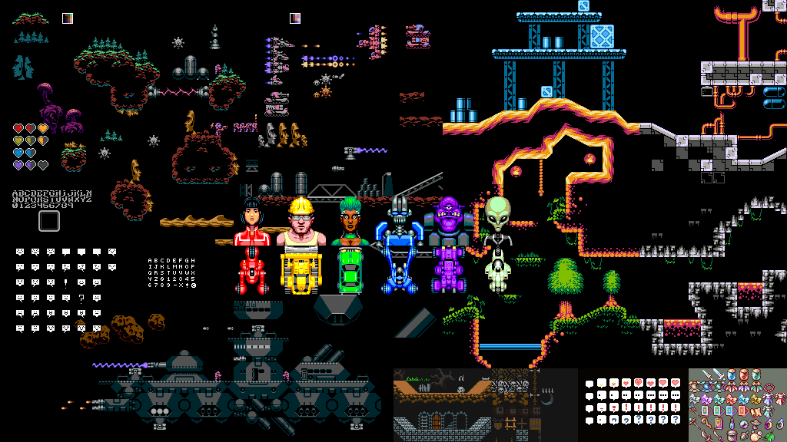

## Inspiration

Modern software almost universally uses [bilinear interpolation](https://en.wikipedia.org/wiki/Comparison_gallery_of_image_scaling_algorithms) scaling [by default](https://developer.mozilla.org/en-US/docs/Web/CSS/image-rendering): this algorithmic bias adversely affects the perception of pixel art. From search engines and game engines to encrypted messengers and social media monoliths, our world needs a more intelligent approach to scaling images.

##### An open source model for classifying pixel art would
* <b>Make viewing, sharing, and manipulating low-res content more accessible
* Improve software via contextually aware default settings or actions</b>

I've collected and annotated a high quality dataset of CC0 pixel art and prototyped a neural network in PyTorch with this functionality. Although classification accuracy is not production-ready, my hope is that this project provides a basis for further iteration by
* Establishing a dataset
* Sharing problematic edge cases
* Indicating viable pathways to reach increased accuracy

## What is [pixel art](https://en.wikipedia.org/wiki/Pixel_art)?

I'm not sure, but I think [we know it when we see it](https://en.wikipedia.org/wiki/I_know_it_when_I_see_it).

Let's assume for now that any content <i>created natively by hand or procedural algorithm</i> bounded within some arbitrarily low resolution square grid is ipso facto pixel art.

Some of the earliest non pixel art games were created for [Nintendo 64](https://en.wikipedia.org/wiki/Nintendo_64), which has a resolution of 320×240. Therefore the prior platform, [NES](https://en.wikipedia.org/wiki/Nintendo_Entertainment_System) at 256x240 likely approaches one perception classifier.

* Low resolution images are not necessarily pixel art
* High resolution images can be pixel art: there is no upper limit
* 3D content can be pixel art
* What is considered pixel art may change over time in response to
    * new rendering techniques applied to retro artstyles
    * adoption of sensory devices that innovate in resolution, display qualia, or interaction mechanisms

#### Data
When I started this project, there were no [open datasets](https://en.wikipedia.org/wiki/List_of_datasets_for_machine-learning_research) available for machine learning on pixel art images.

How to collect a dataset of pixel art from the internet?

<table style="align:right;border:none;position:absolute;">
    <tr>
        <th>
           
       </th>
        <th width=50%>
            <ul float=left>
                <li>
Images from <a href="https://twitter.com/search?q=%23pixelart">tweets tagged with #pixelart
</a></li>
        </th>
    </tr>
    <tr>
        <th>
           
       </th>
        <th>
            <ul style="text-align:left">
                <li><a href="https://opengameart.org/art-search?keys=pixelart">Assets from OpenGameArt filtered by tag, art type, and license</a></li>
            <li><a href="https://www.spriters-resource.com/nes/">Spritesheets, tilesets</a>, or <a href="https://www.mobygames.com/info/standards#Screenshots">screenshots</a> from retro video games</li>
            <li>Pixel art communities like <a href="https://pixeljoint.com/">Pixel Joint</a></li>
            <ul>
        </th>
    </tr>
</table>

Manually cleanup data
* Mislabeled or unrelated data
* Redundancy (animations exported as series of individual images)
* False type indications (ie bmp named image.jpeg)
* Need an approach for animated images (using just the first frame is not viable, training on multiple frames per image complicates tensors)

*assorted public domain pixel art from OpenGameArt*

[How to load a custom dataset in Pytorch](https://pytorch.org/tutorials/beginner/data_loading_tutorial.html)
*Classifying pixel art may require distinct data augmentation approaches such as detecting whether input images are nearest neighbor upscaled.*

## Challenges

One of the major obstacles to IsItPixelArt is that the scope of potential training data is much greater and more ambiguous compared to other image classification tasks.

Edge cases include
* Pixel art created in voxel games like Minecraft
* Upscaled pixel art composed together with non-pixel art textures such as in memes, marketing materials, and post-processing effects. More broadly some images consist of a dynamic mix, often this is expressed in UI. [Aseprite](https://www.aseprite.org/) is a anomalous example of a sprite editor which also renders its UI as pixel art.
* Photos of pixel art subtextures on surfaces including screens, stickers, and shirts; or composed of a material form like beads, LEGOs, etc...
* Non pixel art images scaled down with nearest neighbor
* Blurry, low-quality, or watermarked pixel art
* Non-standard scaling input like [Hqx](https://en.wikipedia.org/wiki/Pixel-art_scaling_algorithms)

There are also significant technical implications for how scaling a pixel art image to fit within a tensor may destroy its essential properties.
*It may make sense to crop images to their most novel subregions instead*

Although I originally considered IsItPixelArt a binary classification problem, this training approach was difficult because it required the neural network to label 'many non-pixel-art images'. I used random images from Wikipedia as a benchmark for this.

## What's next

There are a couple techniques I believe can be used to reach a higher level of accuracy
1. Greater attention to [edge detection](https://en.wikipedia.org/wiki/Edge_detection)
2. [Efficient Neural Architecture Search](https://github.com/carpedm20/ENAS-pytorch)
